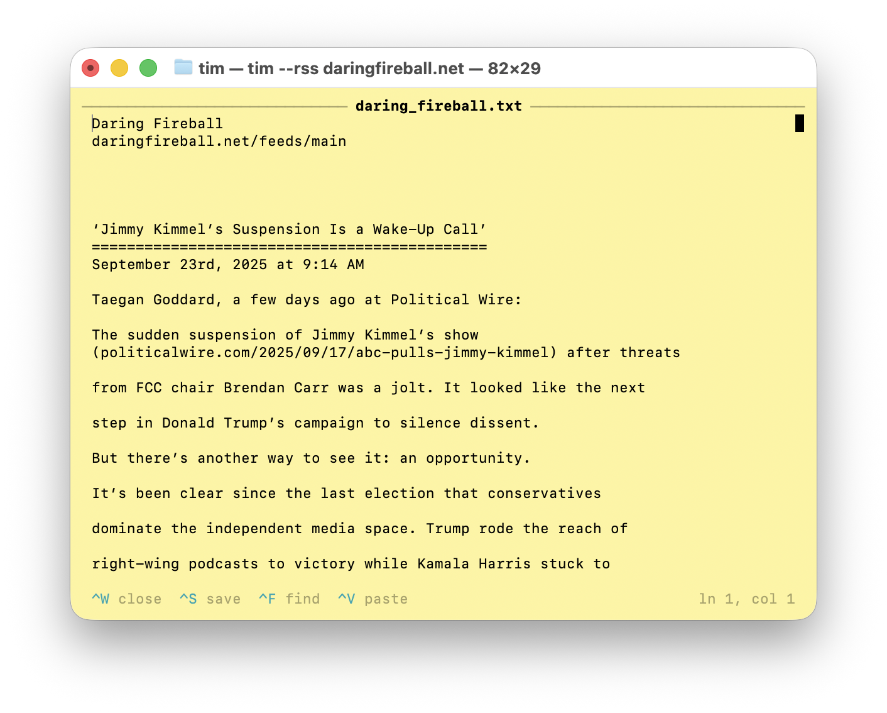

# tim

The Mac-friendly command line text editor.


## Features
- Straightforward macOS editing experience from the command line.
- Familiar macOS text navigation shortcuts.
- Mouse support with single, double, and triple-click selection.
- Mouse wheel support for scrolling longer documents.
- System clipboard copy/paste/cut shortcuts `^C`/`^V`/`^X`.
- Undo/redo shortcuts with `^Z`/`^Y`.
- Save new or edited documents with `^S`.
- Search with `⌃F` and optional `/regex/` search.
- Line numbers toggle with `⌃L`.
- Simple visual marker for documents that have unsaved changes.
- Proportional scrollbar you can drag to scroll through a document.
- Automatic line wrapping.
- Indentation preservation when moving to a new line.
- Automatic avoidance of opening binary files.
- Status footer with command hints, line/column counts, and selection summaries.
- Looks great in with or without terminal colors.
- Mac-like `^Q` and `^W` shortcuts to close `tim`.
- Open documents over HTTP(S) like `tim https://mierau.me`
- Open text-friendly versions of Wikipedia articles like `tim --wikipedia albert einstein`.
- Open text formatted RSS/Atom feeds like `tim --rss www.apple.com/newsroom`.
- Open text formatted Bluesky feeds like `tim --bluesky @blippo.plus`

## Installation
1. Ensure Xcode command line tools or a Swift 5.9+ toolchain is installed.
2. Clone this repository.
3. Build the CLI:
   ```sh
   swift build
   ```
   Add `-c release` for a release optimized build.

## Usage
Open `tim` without arguments to start with an empty buffer:
```sh
tim
```

Open a file, optionally jumping to a specific line:
```sh
tim path/to/file
tim path/to/file:+42
tim +42 path/to/file
```

Open a file over http(s):
```sh
tim https://web.site/document.html
```

Open a text-friendly Wikipedia article:
Option: -w or --wikipedia
```sh
tim -w albert einstein
```

Open an RSS or Atom feed:
Option: -r or --rss
```sh
tim -r https://example.com/feed.xml
```

Open a Bluesky user's public feed:
Option -b or --bluesky
```sh
tim -b mierau.bsky.social
```

Additional flags:
- `tim --help` prints the available options.
- `tim --version` shows the current release tag.
- `tim -` reads buffer contents from standard input (ASCII or UTF-8 text only).
- `tim -r <url>` downloads and formats an RSS/Atom feed.
- `tim -w <article title>` fetches a text-friendly version of a Wikipedia article.
- `tim -b <handle>` fetches a Bluesky profile feed by handle, DID, or profile URL.
- Use `--` before a path that begins with `-` to treat it literally.

Find within the current buffer with `⌃F`, advance matches with `⌃G`, move backward with `⌃R`, and press `Esc` (or `⌃F` a second time) to close. After opening the prompt, pressing `⌃F` moves focus to the document so subsequent typing edits the buffer; run `⌃F` once more to exit. Surround the query with `/` characters to run a regular expression, e.g. `/^[A-Z].*/`.

## License
This project is available under the terms of the [MIT License](LICENSE).

## Project Layout
- `src/app.swift` wires CLI parsing, document loading, and editor launch
- `src/cli.swift` defines the command-line interface (`tim`, `-w`, `-r`, `-b`, etc.)
- `src/editorcontroller.swift` runs the terminal session and render loop
- `src/editorstate.swift` stores buffer contents, selections, undo stacks, layout cache, and UI flags
- `src/actions.swift` applies text mutations, clipboard operations, and undo bookkeeping
- `src/input.swift` reads raw key bytes
- `src/keys.swift` translates key combos into editor actions
- `src/mouse.swift` processes mouse wheel clicks/drags and scrollbar interaction
- `src/layout.swift` converts logical lines into wrapped visual rows
- `src/renderer.swift` draws the editor frame, gutter, footer, highlights, and cursor
- `src/scrollbar.swift` computes proportional scrollbar geometry consumed by the renderer
- `src/terminal.swift` handles escape sequences, raw-mode setup, and alt-screen helpers
- `src/documentloader.swift` coordinates local files, stdin, HTTP, Wikipedia, RSS, and Bluesky sources
- `src/http.swift` provides synchronous networking utilities used by the loaders
- `src/wikipedia.swift` formats article extracts for the editor
- `src/rss.swift` parses feeds and renders plain-text timelines
- `src/bluesky.swift` talks to the public Bluesky API and normalizes posts
- `src/clipboard.swift` bridges to macOS `pbcopy`/`pbpaste`
- `src/control.swift` houses small reusable UI helper structs
- `src/textfield.swift` implements the editable field used by the find prompt and similar UI

## Screenshots

Use `tim` to open text-friendly Wikipedia articles by title.

`tim --wikipedia albert einstein`


---

Use `tim` to open text formatted RSS/Atom feeds.

`tim --rss daringfireball.net`


---

Use `tim` to open text formatted Bluesky feeds.

`tim --bluesky @panic.com`

